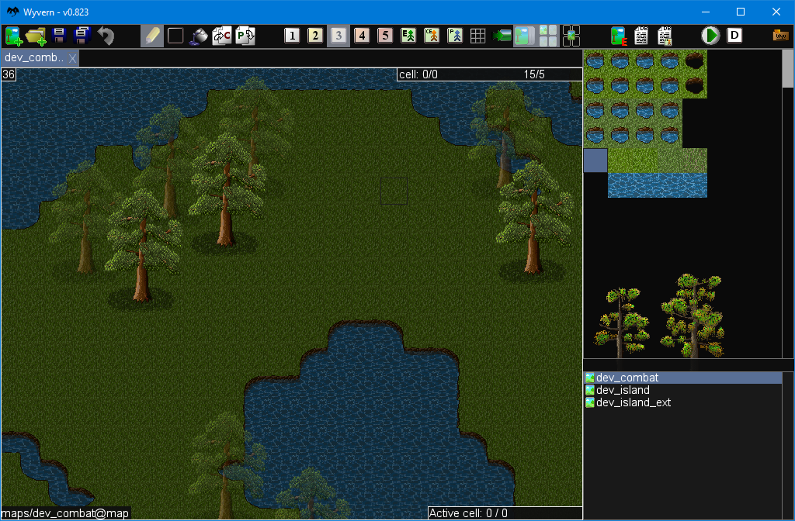
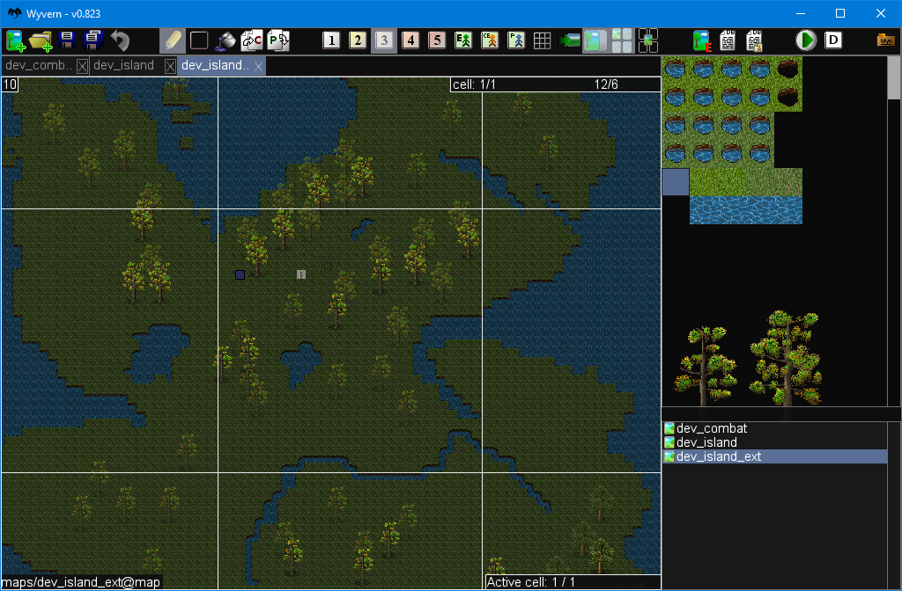
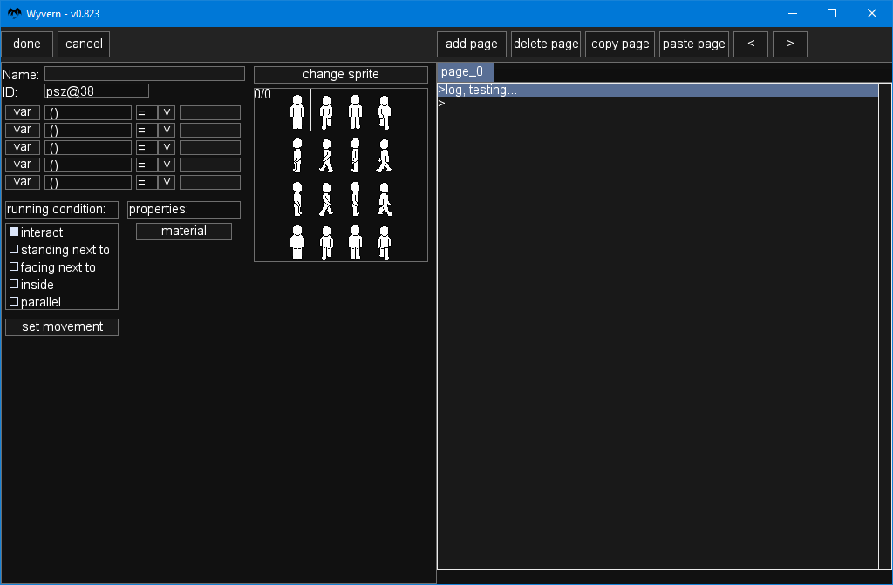
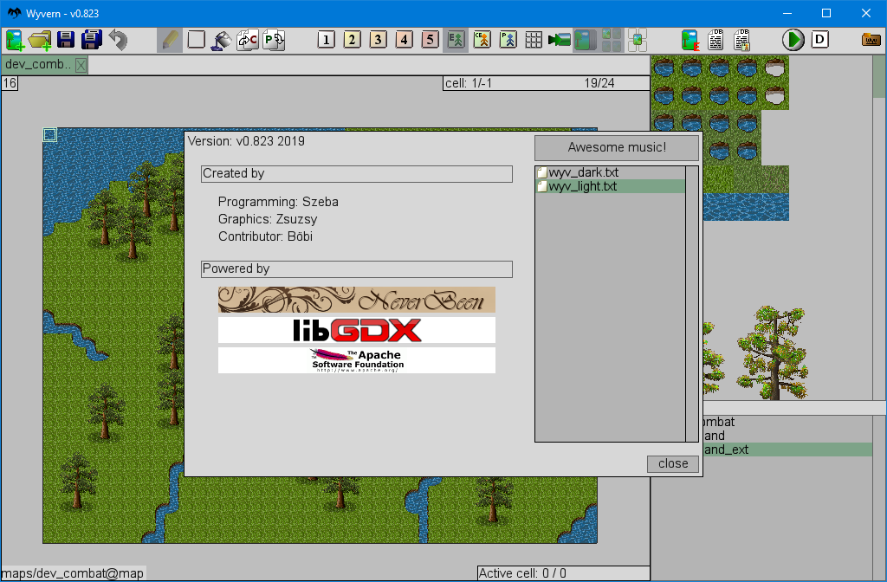
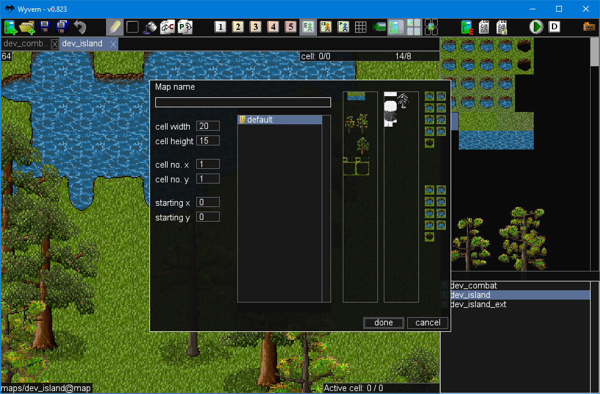

# Wyvern editor
Wyvern is a long running project, created to provide an open source alternative for Kadokawa-s RPG Maker software.
The editor is capable of creating 2D maps, editing database for a game, managing resources, creating events, playtesting, and more.
All features are created in a way, that can be extended to support multiple game engines.
The editor supports an experimental GUI editor to create dynamic GUI interfaces for managing game data.

## Building requirements
- JDK 8

## Building
>./gradlew.bat desktop:dist

- Copy the jar from desktop/build/libs/ to core/
- Rename the jar to "Wyvern.jar"
- Copy the following files from "core/core files/config base" to "core/core files/":
  - interpreter.wdat
  - main_config.wdat
  - preview_panel.wdat
  - signature.txt
- Copy the default_interpreter folder to core/interpreters/ (Note: create core/interpreters/ if doesnt exist)
- Rename the default_interpreter/ folder to default/
- Delete the following file: core/interpreters/default/database/entries/DELETE_ME

If successfully did the above, you can launch the editor with double clicking Wyvern.jar in core/

## NOTE: The windows_launcher.bat file is for the portable version (if a JRE is included with the editor)
